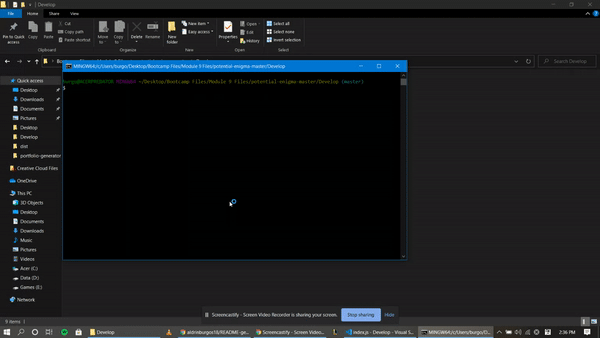
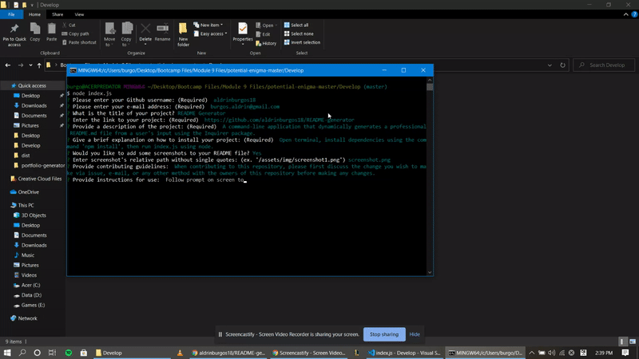
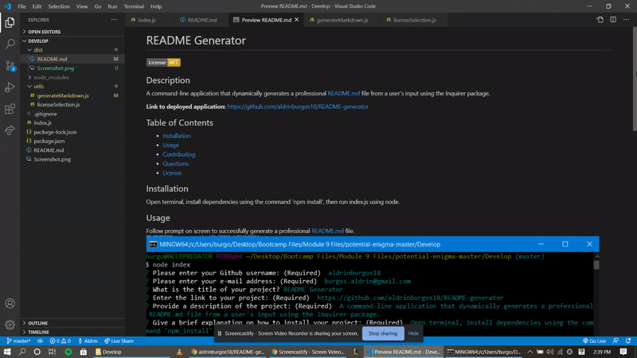
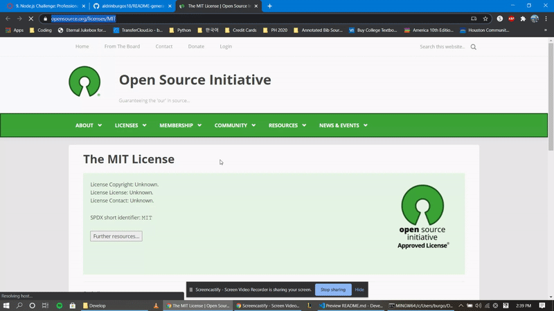

# Readme Gen

## Description

A simple Github reamde generator created with Node.js and Inquirer.js

**Link to deployed application:** [https://github.com/aldrinburgos18/readme-gen-3](https://github.com/aldrinburgos18/readme-gen-3)

## Table of Contents

- [Installation](#installation)
- [Usage](#usage)
- [Contributing](#contributing)
- [Questions](#questions)
- [License](#license)

## Installation

Open terminal, install dependencies using the command 'npm_install'.

## Usage

Open terminal then run index.js using node.

Answer on screen prompt to generate values for README.

Preview of finished product:

Clicking on "more information" directs user to license information page.

## Contributing

When contributing to this repository, please first discuss the change you wish to make via issue, email, or any other method with the owners of this repository before making a change.

## Questions

If you have any additional questions, please feel free to contact me at:  
 E-mail: burgos.aldrin@gmail.com  
 Github: [aldrinburgos18](https://github.com/aldrinburgos18)

## License

  
 A short and simple permissive license with conditions only requiring preservation of copyright and license notices. Licensed works, modifications, and larger works may be distributed under different terms and without source code.  
 _[More Information about this license...](https://opensource.org/licenses/MIT)_
